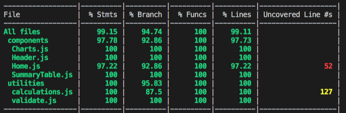

THE APP IS DEPLOYED TO : https://mortgage-calculation-app.herokuapp.com/

How to run the app on local :

### `git clone the repo`
 - cd into your desired dir folder 
 - git clone https://github.com/shubhamchauhan4488/mortgage-calculator.git
 
### `yarn`
Run yarn install to install the packages

### `yarn start`
Runs the app in the development mode. 
Open [http://localhost:3000](http://localhost:3000) to view it in the browser.

### `yarn test`
Launch this to check all the tes cases running
See the section about [running tests](https://facebook.github.io/create-react-app/docs/running-tests) for more information.

Test Coverage

### Deployment

This app has been deploted here: https://mortgage-calculation-app.herokuapp.com/
